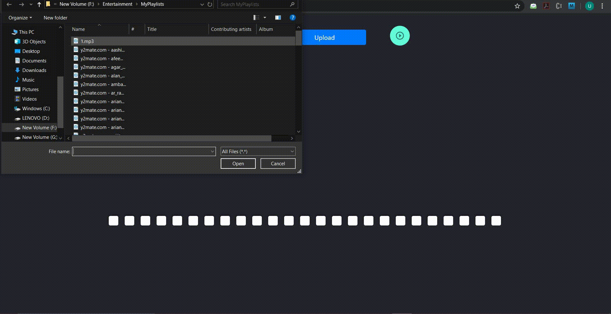

# audio-visualization-2


An audio visualization react app which when played visualizes audio on the basis of amplitude.
This is version-2 of [audio-visualization](https://github.com/uditiarora/audio-visualization).


## Run the app
1. Clone the repo
    ```sh
    git clone https://github.com/uditiarora/audio-visualization-2.git
   ```
2. Install libraries
    ```sh
    npm install
    ```

3. Run
    ```sh
    npm run dev
    ```



